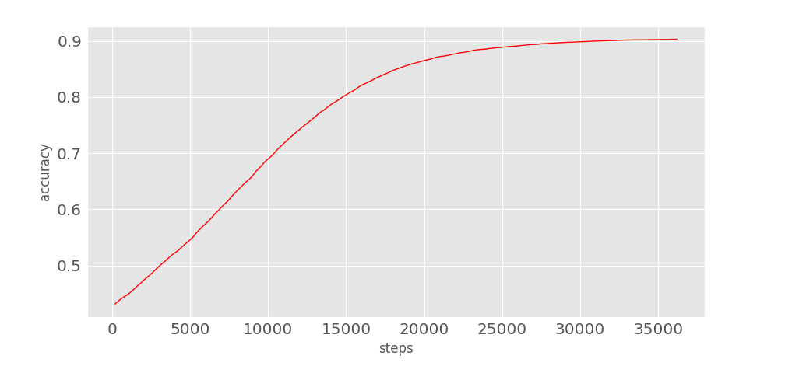
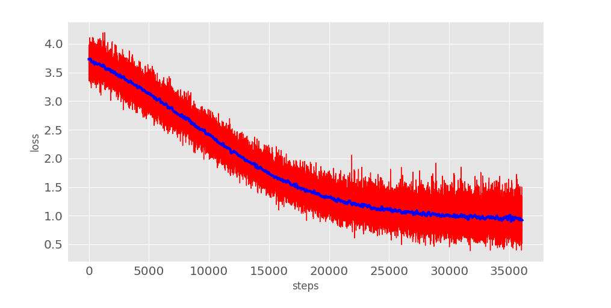

# InsuranceQA-Machine-Learning

Question and Answer Experimentals with Machine Learning Technologies for [insuranceqa-corpus-zh](https://github.com/Samurais/insuranceqa-corpus-zh).


# Welcome

Apply different models with [insuranceqa-corpus-zh](https://github.com/Samurais/insuranceqa-corpus-zh).


## Deps
Python3+

```
pip install -r Requirements.txt
```

## deep\_qa_1
A very simple network
```
python3 deep_qa_1/network.py
python3 visual/accuracy.py
python3 visual/loss.py
```

Baseline: hidden_layers = [100, 50], lr = 0.0001.





# LICENSE
[Apache2.0](./LICENSE)